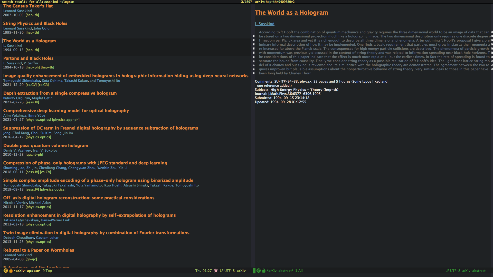

[](https://melpa.org/#/arxiv-mode)    [](https://stable.melpa.org/#/arxiv-mode)

# arXiv-mode

arxiv-mode is an [Emacs](www.gnu.org/s/emacs/‎) major mode for viewing 
updates on [arXiv.org](http://arxiv.org).




## Common Usage

arxiv-mode provides many functions for accessing [arXiv.org](http://arxiv.org).
To browse the daily new submissions list in a category, run `M-x arxiv-read-new`.
To browse the recent (weekly) submissions, run `M-x arxiv-read-recent`.
Use `M-x arxiv-read-author` to search for specific author(s).
Use `M-x arxiv-search` to perform a simple search on the arXiv database.

For more complicated searches, use `M-x arxiv-complex-search`.
This command allows user to dynamically refine and modify search conditions.
You can also use `r` to refine search condition in the abstract list obtained from a search.

In the article list, use `n` and `p` to navigate the article list.
Press `SPC` to toggle visibility of the abstract window.
Press `RET` to open the entry in a web browser. Press `d` to download the pdf.
Press `b` to export the bibtex entry of current paper to your specified .bib file.
Press `B` to export the bibtex entry to a new buffer.
Press `e` to download pdf and add a bibtex entry with a link to the actual pdf file.

All available commands are listed in a hydra help menu accessable by `?` whenever you are in the article list.

## Installation

arxiv-mode is available on MELPA.
After `M-x package-install RET arxiv-mode RET`, put the following code in your `init.el`:
````lisp
(require 'arxiv-mode)
````
Or if you use `use-package`, you can simply put:
````lisp
(use-package arxiv-mode
  :ensure t)
````
into the your init file. `use-package` will automatically download `arxiv-mode` for you.

## Customization

Run `M-x arxiv-customize` to customize or set the customization variables directly:

### appearance
The variable `arxiv-use-variable-pitch` decides whether to use monospace fonts or variable pitch fonts to display the contents of arxiv mode.
You can also set the relevant faces (faces start with `arxiv-`) directly.
The variable `arxiv-author-list-maximum` sets the maximum number of authors to display in the query list.

### behavior
If you set `arxiv-startup-with-abstract-window` to `t`, arxiv-mode will default to startup with the abstract window open instead of a plain query list.
The default category used for query can be set by changing the variable `arxiv-default-category`.
The variable `arxiv-entries-per-fetch` sets the maximum number of articles arxiv-mode will try to query each time from arxiv.org (Note that setting this number too high will cause emacs to stutter).

### download and export
By default, arxiv-mode will save downloaded PDFs to `~/Downloads` folder. You can change the folder by setting the variable `arxiv-default-download-folder`.
It also defaults to open the PDFs inside emacs. Change `arxiv-pdf-open-function` if you want to open the file in an external application.
For example, to open in Preview.app in macOS:
````lisp
  (setq arxiv-pdf-open-function (lambda (fpath) (call-process "open" nil 0 nil "-a" "/Applications/Preview.app" fpath)))
````
arxiv-mode will default to export the bibtex entry of paper to file `arxiv-default-bibliography`.


